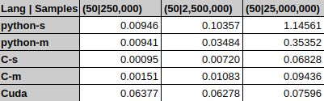

# Random select k samples from 1-n
In this project, I utilized two languages, python and C, to achieve the task with single and multi-threads respectively.Python with numpy is a very common method to manipulate data, C is one of the fastest language. The result shows the gap between them including workload and efficiency.

## Algorithm
*Python*: 
- np.arange: generate 1-D array
- np.random.choice: pick up one number from generated 1-D array without replacement.
- sorted: sort

*C*:
- getSerise: generate 1-D array pointer
- getRandom: generate 1-D array pointer randomly picked up from 1-n series

*multi-threads*
Both python and C use some way to achieve multi-threads. 
- parallelly generate 1-D arrays by m threads, each thread creates n/m samples.
- parallelly random pick up k/m samples in each thread
- group all randomly selected samples together

## Result
Select 50 samples from 1-250,000 
1. One Thread by python

`('Output:', [2422, 8910, 12903, 34308, 37921, 38709, 40492, 45739, 53815, 64226, 65110, 66591, 75926, 82691, 82805, 85645, 87716, 88625, 93456, 94278, 99126, 111603, 114058, 116141, 120500, 126894, 128969, 133790, 138335, 142473, 148205, 154500, 155132, 169132, 172506, 174684, 175923, 176376, 178461, 179771, 179849, 181628, 186401, 209867, 219945, 229984, 235657, 239773, 240641, 240742])
('Spend:', '0.00946497917175s')`

2.Five Threads by python

`Output:
[  2207   2601   9048  11607  12197  16669  25608  26248  34591  35068
  50090  51462  58052  58460  63520  73657  77443  90163  92405  92537
 102838 103314 109437 111960 116297 123123 126005 135438 146466 149652
 151512 155970 159486 166478 167975 176262 177076 183298 185048 196460
 205071 207474 209496 215928 216236 221410 224167 233927 235748 242700]
('Spend:', '0.00940680503845s')`

3. One Thread by C

`Output:1958 3355 11099 19345 19769 20819 27233 45767 54764 58367 61831 61842 68477 82408 88667 88937 89033 92233 99264 104176 106067 106289 110660 115275 118549 123665 126504 126836 137823 150923 152174 155084 155482 163291 164655 165201 174358 177969 180497 183751 188245 191142 198119 200179 201204 218092 223490 224615 226565 233951 
 Spend: 0.000951 s`

 4. Five Threads by C
 
 `Output:1705 1757 5257 14592 18356 24935 28107 28507 37510 39263 61017 61848 63287 66684 79270 81748 82427 85668 86908 92234 102651 108063 110278 117535 121519 126369 131718 135699 146891 149128 153796 154356 156780 168388 174234 179515 185213 186723 192180 198538 200356 205078 206718 208654 210269 214148 219298 220688 224290 230998 
 cost 0.001511 s`
 
 ## Efficiency
 Hardware: Xeon 1230 v3 3.3Ghz(4C,8T), 16GB RAM(DDR3-1600)
 
 
 
 
 
 C is much faster than python, specially data is raising fast.Python's multi-threads is significantly better than single thread. However, I don't know why C's multi-threads is almost same as single thread. In multi-threads C, I found CPU usage is lower than 30% for each thread.Maybe create threads needs time???
 
 ## workload
 
 
 
 python is much easier coding than C, there are bunch of existing libaries written by cpython we can use.
