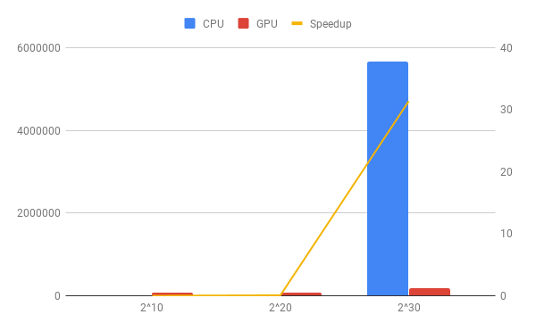

## Reduction Sum

### Two versions

- Cuda version(GTX950 128bit 6600Mhz 2GB):

`workperform.cc`: main function which invokes `innerproduct` in cuda file.

`workperform.cu`: cuda file, inculds reduction sum function. 

- CPU version(E3-1230 v3 3.3GHz)

`CPU.cc`: single thread running on cpu for evaluation, which needs at least 8.5GB for allocating 2^30 unsigned longlong data.

### Strategy

1. fully utilization of each thread in GPU
2. reduce I/O time by shared memeory in each block
3. 2GB can store 2^30\*8/block_size data

### Method [1]

1. generate product of two vectors at once by kernel
2. Using Sequential Addressing to sum up the products. 
3. Unroll the Last Warp, since we don't need syncthreads in a warp.
4. Unroll the a fixed block size.
5. Multiple Adds(didn't work in this case)

### Performance analysis

1. Speed up

| Data Size | CPU(usec) | GPU(usec) | Speedup   | 
|-----------|-----------|-----------|-----------| 
| 2^10      | 7         | 80166     | 0.000087  | 
| 2^20      | 6334      | 79361     | 0.079813  | 
| 2^30      | 5654058   | 180244    | 31.368911 | 

When data size is relatively small, CPU is running faster than GPU, since there is a latency from memory to GPU. But when the data size grow up to 2^30, the GPU is more than 30X faster than single thread on CPU. 

2. Bandwidth Utility

Since I used `unsigned long long` to create vector, each element takes 8 bytes, hence 

Actual Bandwidth = 2^30\*8/1000/1000/180.244=47.64GB/s

Max Bandwidth=105.6GB/s

E = 47.64/105.6=46%

3. Issue

It only used half threads in a block. but if I changed it to multi-add when generating products of two vectors, it became slower instead, I guess "%" or "if else" slowed down the performance. 

> Reference:  
> [1] "Optimizing Parallel Reduction in CUDA" by Mark Harris
