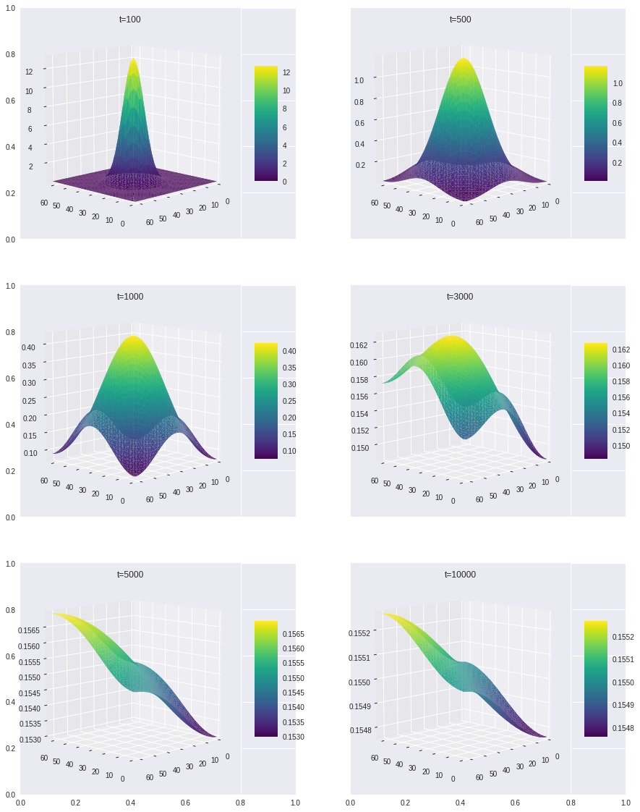
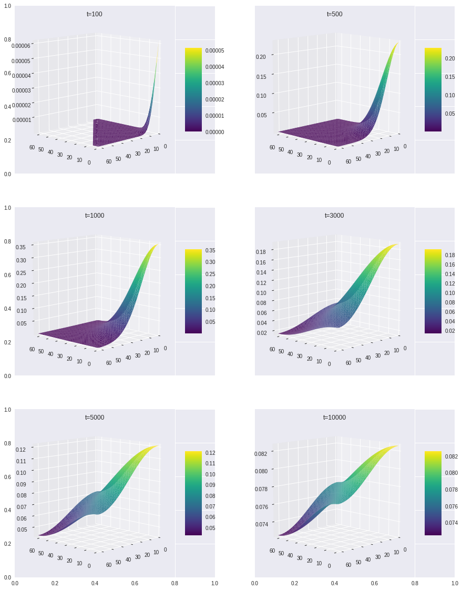
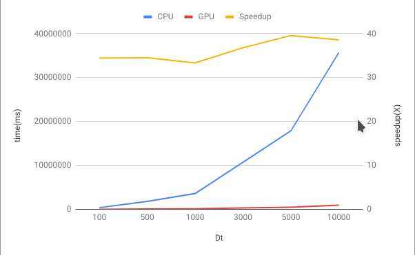
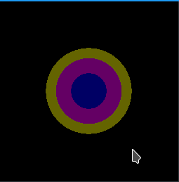
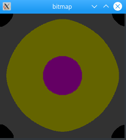
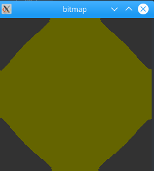

# Diffusion Simulation
## Assumption
1. A 3D space created with size of 64\*64\*64
2. There is not any other object in the space, as the pollution reaches to the edge of space, it will rebound
3. The source of pollution can be a block or a point. By default, it is a point(value=20000) in the position [x:32]-[y:32]-[z:32].
4. Let dt=1 , dx=1 , dy=1, dz=1, so that <a href="https://www.codecogs.com/eqnedit.php?latex=U_{x,y,z}(t&plus;1)&space;=&space;\frac{U_{x&plus;1,y,z}(t)&plus;U_{x-1,y,z}(t)&plus;U_{x,y&plus;1,z}(t)&plus;U_{x,y-1,z}(t)&plus;U_{x,y,z&plus;1}(t)&plus;U_{x,y,z-1}(t)}{6}" target="_blank"></a>

## Strategy
1. Create two kernel functions: `diffusion` and `refresh`. `Diffusion` is used to calculate U(t+1) in term of U(t). `Refresh` is used to update the value in the space after calculation step. 
2. There is a time loop in the host to call `diffusion` and `refresh` in order to achieve global blocks synchronization.
3. A CPU version `diffusion` function created to validate the result and speed up.
4. Grid size = 64\*64\*64 ; Block size = 8\*8\*8

## Result
Since 3D object is hard to observe from outside, I choose the central slice which Z=32 to visualize the result when dt equals to 100,500,1000,3000,5000,10000 respectively. The surface plot can be found blew:



`Figure[1-1]: source point = [x:32][y:32][z:32], slice Z=32`

As time goes by, the pollution starts to fill the whole space. Also the concentration of each postion trends to even. When dt=5000 or 10000, the shape of concentration is not a symmetrical structure anymore although the difference between maximum and minimum is very tiny. I think the possible reason is the start point is not the central of space, it is faster to reach one side than another.

Then I changed the source of pollution to [x:0][y:0][z:0], keep slice Z=32. The surface plot can be found blew:


`Figure[1-2]: source point = [x:0][y:0][z:0], slice Z=32`

The last two plots are almost as same as Figure[1-1].

## Validation and Performance
A CPU version created for result validation and performance analysis. The function called `diffusion_cpu`. Compared with CPU version, the GPU version running significantly faster which can reach up to 34x ~ 39x acceleration.




| time/speed up | CPU      | GPU    | Speedup |
|---------------|----------|--------|---------|
| 100           | 362818   | 10536  | 34.44   |
| 500           | 1783376  | 51678  | 34.51   |
| 1000          | 3584415  | 107517 | 33.34   |
| 3000          | 10716670 | 291210 | 36.80   |
| 5000          | 17892344 | 452127 | 39.57   |
| 10000         | 35695658 | 925076 | 38.59   |

## Real-Time Visualization
To avoid affect performance analysis, there is a separated file named `DS-OpenGL.cu` created for real-time visualization. The space size changed to 256\*256\*256 and slice is Z=128. The heat-map simply fellow the rule with only 4 colors:
```cpp
 if(output_array[idz][idy][idx]>10){
                ptr[offset].x = 0;
                ptr[offset].y = 0;
                ptr[offset].z = 100;
                ptr[offset].w = 255;}
            else if(output_array[idz][idy][idx]>1){
                ptr[offset].x = 100;
                ptr[offset].y = 0;
                ptr[offset].z = 100;
                ptr[offset].w = 255;
            }else if(output_array[idz][idy][idx]>0.1){
                ptr[offset].x = 100;
                ptr[offset].y = 100;
                ptr[offset].z = 0;
                ptr[offset].w = 255;
            }else if(output_array[idz][idy][idx]>0.01){
                ptr[offset].x = 50;
                ptr[offset].y = 50;
                ptr[offset].z = 50;
                ptr[offset].w = 255;
            }
```
Here is three screen shots by time = 1000, 6000, 10000






