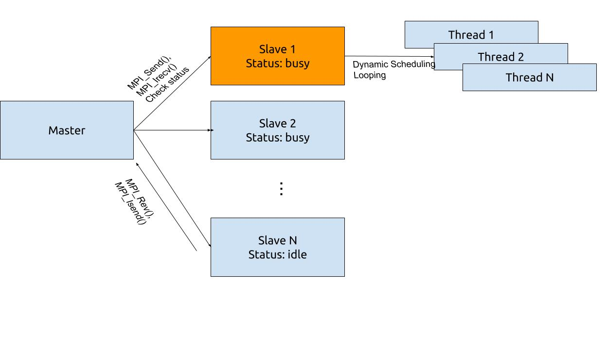
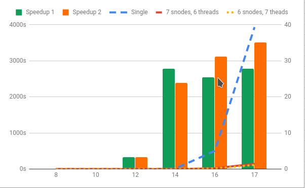

# N Queen Problem 
## Solution with MPI and OpenMP
1. In the cluster, a Master - Slave structure set up. Master node responses to send the task to slave nodes and regularly check the status of all slave nodes(busy or idle). Salve nodes response to split task from master into sub tasks running with multi-threads.
2. Master node assigns tasks by iterating each row of the first column in the lattice. If all slave nodes are busy, master will waiting for feedback from slave nodes, otherwise master node will send the new task to the idle slave node.
3. Master node uses non-blocking method(Irecv) to get the feedback from slave node. So that master node is able to check status of all slave nodes as well as receive feedback.
4. Slave node splits task into subtask by iterating each row of the second column in the lattice, which is running in a dynamic schedule looping. So that each thread can keep busy all time.



## Validation
There is a single thread version created named "NQ-Single.cpp". And MPI version named "NQ-MPI.cpp".
```c++
//  8:              92
// 10:             724
// 12:           14200
// 14:          365596
// 16:        14772512
// 17:        95815104 
```

## Compile and running
```c++
compile with openmp: mpic++ -fopenmp NQ-MPI.cpp -o NQ
run in mpi: mpirun -np 5 --host arch06,arch07,arch04,arch05,arch08 ./NQ
set lattice size: #define N 16
set max threads in each slave node:#define MAXTHREAD 16
```

## Performance analysis
Three different configurations are set up for performance analysis. 
1. Only single thread on one node
2. 1 master node, 7 slave nodes with 6 threads
3. 1 master node, 6 slave nodes with 7 threads

My purpose is finding how speedup we can get from this cluster, and comparing threads and nodes efficiency. 

| Size | Single     | 7 snodes, 6 threads | 6 snodes, 7 theads | Speedup 1 | Speedup 2 |
|------|------------|---------------------|--------------------|-----------|-----------|
| 8    | 791        | 81643               | 72001              | 0.010     | 0.011     |
| 10   | 17775      | 71692               | 72022              | 0.248     | 0.247     |
| 12   | 265434     | 80418               | 81074              | 3.301     | 3.274     |
| 14   | 10357783   | 372844              | 433619             | 27.780    | 23.887    |
| 16   | 502196237  | 19704982            | 16142619           | 25.486    | 31.110    |
| 17   | 3932259719 | 141427932           | 112265384          | 27.804    | 35.026    |



When lattice size is small than 14, the elapsed Time is very few and we can't get significant speedup since the computation time on the slave nodes is much less than communication time. But when the lattice size reaches up to 14 or more, we can get 25x-35x speedup since each slave node take enough time to do the sub tasks.
Also, we can find adding thread in single node is more efficient than adding nodes. The problem is threads are not easy scalable.And the efficiency gap between than are acceptable.
