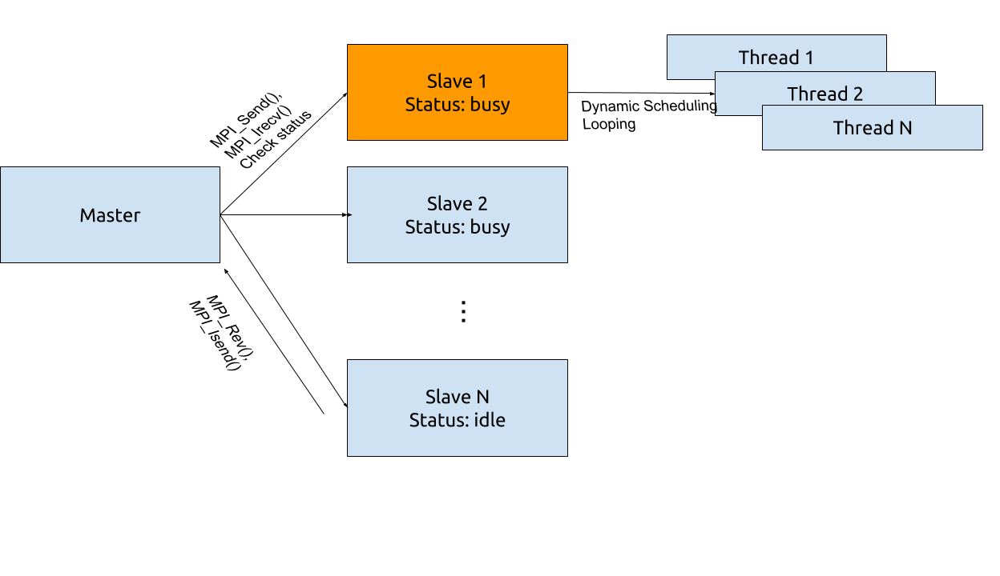

# N Qeen Problem 
## Solution with MPI and OpenMP
1. In the cluster, a Master - Slave structre set up. Master node responses to send the task to salve nodes and regularly check the status of all salve nodes(busy or idle). Salve nodes response to split task from master into sub tasks runing with multi-threads.
2. Master node assigns tasks by iternating each row of the first column in the lattice. If all salve nodes are busy, master will waiting for feedback from slave nodes, otherwise master node will send the new task to the idle slave node.
3. Master node uses non-blocking method(Irecv) to get the feedback from slave node. So that master node is able to check status of all slave nodes as well as receive feedback.
4. Slave node splits task into sub task by iternating each row of the second column in the lattice, which is runing in a dynamic schedule looping. So that each thread can keep busy all time.

## Validation
There is a single thread version created named "NQ-Single.cpp". And MPI version named "NQ-MPI.cpp".

## Performance

