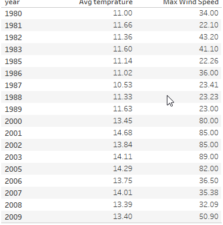
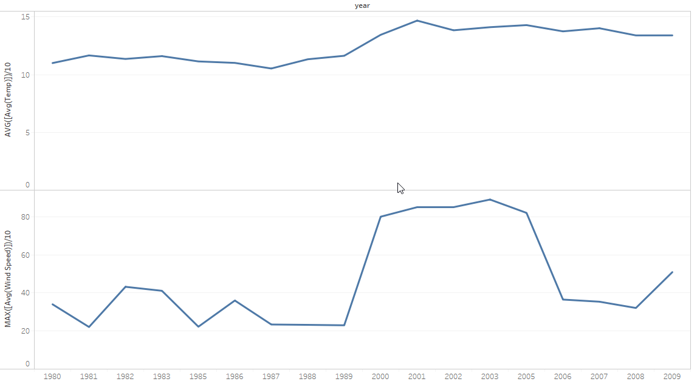
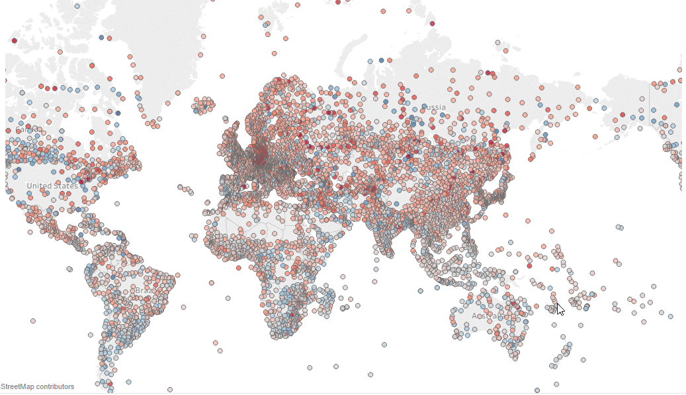
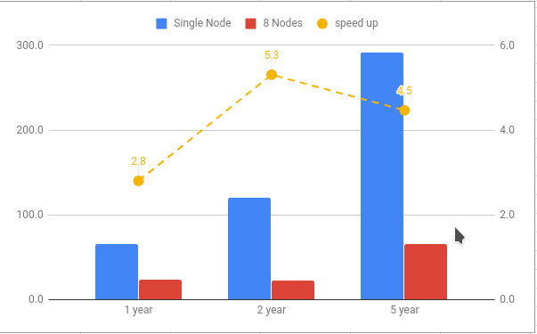

### Purpose
Using pyspark to help analysis the situation of global warming. The data is from NCDC(http://www.ncdc.noaa.gov/) through 1980 to 1989 and 2000 to 2009(except 1984 and 2004).

### Two Stretage
* Get the max/min temperature and max wind speed only filter mistaken data(9999). Steps are as follows:
  * Load files into RDD: `sc.textFile("/home/DATA/NOAA_weather/{198[0-3],198[5-9]}/*.gz")`
  * Extract fields from files through map function: `parse_record`
  * Filter 9999 data: `.filter(lambda x: x[1]!=9999)`
  * reducebyKey to get max or min data ( the key is `year`): `.reduceByKey(lambda x,y: max(x,y)`
  
* Get the average temperature and avg wind speed by year, latitude and longitude of station which is a fixed land station.
  * Load files into RDD. Same as mapreduce
  * Load RDD to Dataframe. `sqlContext.createDataFrame(all_fields,schema=["date","report_type","lat","lon","wind_speed","wind_qulity","temp"])`
  * Filter error data(9999) and station type(FM-12) `df.where((df['lat']!='+9999') & (df['lon']!='+9999') & (df['wind_speed']!=9999) & (df['temp']!=9999) & (df['report_type']=='FM-12'))`
  * aggregate average by year, latitude and longitude:`df.groupBy(['date',"lat","lon"]).agg({"wind_speed":"avg","temp":"avg"})`


### Result and visualization
* the max/min temperature and max wind speed(based on stretage 1.)
```
year, max_temp(10x), min_temp(10x), max_wind_speed(10x)
1980,600,-780,617
1981,580,-850,618
1983,616,-931,618
1984,617,-932,618
1982,617,-930,700
1986,607,-901,607
1987,607,-900,602
1985,611,-932,618
1989,606,-900,900
2000,568,-900,900
1988,607,-900,618
2002,568,-932,900
2001,568,-900,900
2003,565,-900,900
2005,610,-925,900
2006,610,-917,900
2007,610,-900,900
2008,610,-900,900
2009,610,-854,900
```
These extreme data maybe happen in special area, like Antarctica or Sahara Desert.

* the average temperature and avg wind speed by year, latitude and longitude(based on stretage 2.)





Through trend line chat, we can figure out the temperature in 2000 to 2009 is significantly higher(1.5-2.0℃) than in 1980 to 1989. Also the max wind speed is greater than mostly before.

Let's create another chat, which shows the temperature difference between two decades.



The red color means weather becomes warm, otherwise weather becomes cold. In the most of countries, the red dots are more than cold ones. The most serious area is Europe.

### Performance 
I/O is inculded in the chats blew. Compared with single nodes, the cluster with 8 nodes gets 2.8x-5x speedup. The result is not ideal. I guess the I/O and communication take a little bit long time.



### Problem
* mapreduce performance. It is easy to out of space or memory if there is a poor mapreduce design. In my first stretage, this mapreduce inculds three rdds, which makes it couldn't handle more than three years' files.
* Sometimes, there are GC error in java if we run 20 years' data at once.Since spark is hight level framework, it's hard to handle errors than MPI.
* To make the visualization more clear, we can merge the one dot with others around it, like pixel combine.

### Files
* `infor_extra.py`: main file to execute in spark, output a single csv file in the folder named `output1`
* `weather_gap.py`: caculate the gap between two decades, export to `output.csv`
* If out of memory or GC error happens, please squeeze the year range in `infor_extra.py`. `rdd = sc.textFile("/home/DATA/NOAA_weather/{198[0-3],198[5-9]}/*.gz")`
